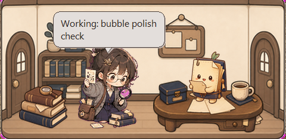

# Pet Studio

[](CHANGELOG.md)
[](LICENSE)

Give a Codex pet its own desktop studio room.

Pet Studio is a Codex skill and lightweight widget runtime for turning a hatch-pet into a layered desktop room. It keeps the room, props, main pet, helper pets, and speech bubbles editable instead of flattening them into one image.

Current release: `v0.1.0`

## What It Does

- Builds a layered `384x240` Pet Studio room from a hatch-pet package.
- Keeps room, props, pets, and helper pets as separate editable layers.
- Validates room kits so mismatched assets are caught early.
- Renders preview and contact-sheet images for visual QA.
- Registers rooms to local project ids.
- Runs a frameless desktop widget that can show project state such as working, waiting, review, blocked, and done.
- Accepts Codex-style event payloads through a small local adapter.

## Requirements

- Windows is the primary tested widget host.
- Python 3.11+ with Pillow.
- Codex Desktop or a local Codex skill folder for `$pet-studio`.
- A hatch-pet package to use as the style source when creating new rooms.

## Install

Clone the repo and install the skill:

```powershell
git clone https://github.com/makesomethingshit/codex-pet-studio-skill.git
cd codex-pet-studio-skill
python tools\install_pet_studio_skill.py
```

To replace an older installed copy:

```powershell
python tools\install_pet_studio_skill.py --force
```

The installer copies the skill to:

```text
%USERPROFILE%\.codex\skills\pet-studio
```

The repository also keeps the older `project-room-*` file names as the v1 compatibility format. New public commands use Pet Studio names.

## Use It With Codex

After installing, talk to Codex normally. Useful prompts:

```text
Create a Pet Studio room for my current Codex pet.
```

```text
Use my Gakju pet as the style source and make a cozy archive room.
```

```text
Register this room to the current workspace and launch the widget.
```

```text
Set the Pet Studio state to blocked with the message "waiting on approval".
```

Codex should guide the workflow, ask for missing art inputs, run validation, and report the generated files.

## Example Room

This repository includes a public Gakju archive room sample built from separated room, prop, main pet, helper pet, and runtime speech-bubble layers.



You can render or inspect the checked-in sample without generating new art:

```powershell
python project-room-widget\pet_studio_widget.py --kit runs\gakju-imagegen-room-v1\kit --render-once runs\gakju-imagegen-room-v1\widget-render-test.png
```

The sample files under `runs/gakju-imagegen-room-v1/` are intended as public examples. Local QA reports, private test runs, and fresh project experiments stay ignored by git.

## Try The Demo

List registered room projects:

```powershell
python project-room-widget\pet_studio_widget.py --list-projects
```

Launch the included demo room:

```powershell
python project-room-widget\pet_studio_widget.py --project-id gakju-archive-demo --scale 1.25
```

Render one frame without opening the widget:

```powershell
python project-room-widget\pet_studio_widget.py --project-id gakju-archive-demo --render-project-once runs\widget-render-test.png
```

## Widget Controls

- Drag props or pets to reposition them.
- Drag the room background or empty space to move the widget window.
- Right-click for the context menu.
- Use `Larger`, `Smaller`, or `Reset size` from the context menu.
- Press `Ctrl` + `+`, `Ctrl` + `-`, or `Ctrl` + `0` for size controls.
- Press `Escape` to close.

Registered projects persist moved anchors and window scale locally.

## Project State

Update the active project state directly:

```powershell
python project-room-widget\set_pet_studio_state.py --project-id gakju-archive-demo --state running --message "building room kit"
```

Publish a Codex-style event:

```powershell
python project-room-widget\pet_studio_event_adapter.py --project-id gakju-archive-demo --event start --message "working"
```

Or send a structured JSON payload, which is the command target intended for future Codex host hooks:

```powershell
'{"event":"start","message":"working","projectId":"gakju-archive-demo"}' | python project-room-widget\pet_studio_event_adapter.py --event-json -
```

When no project id is provided, the adapter resolves project identity in this order:

1. Explicit `projectId`
2. Active project pin
3. Workspace path matching

Pin an active project when several rooms share one workspace:

```powershell
python project-room-widget\set_active_pet_studio.py --project-id gakju-archive-demo --cwd .
```

State messages appear as runtime speech bubbles. Long messages are whitespace-normalized and capped at 80 characters so hook output stays compact.

For local Codex bubble integration, install the Pet Studio notify bridge:

```powershell
python tools\install_pet_studio_codex_integration.py
```

The installer:

- installs the skill as `$pet-studio` under `%USERPROFILE%\.codex\skills\pet-studio`
- backs up `%USERPROFILE%\.codex\config.toml`
- wraps the existing Codex `notify` command so Pet Studio updates the widget state bridge when turns end
- can write an active project pin when `--project-id` is provided

For fuller lifecycle integration, this repo also ships `.codex-plugin/plugin.json` and `hooks/hooks.codex.json`. Those hooks call `project-room-widget\codex_pet_hook.py` for session start, prompt submit, tool use, compaction, and stop events.

## What Gets Created

Typical generated output includes:

```text
runs/my-pet-studio-room/
  kit/
    project-room.json
    style-lock.json
    rooms/
    props/
    pets/
  generation-brief.json
  kit-validation.json
  production-report.json
  room-preview.png
  room-contact.png
```

Local QA evidence and experimental run folders are intentionally ignored by git unless you choose to preserve them.

## Repository Layout

- `project-room-kit/` - source folder for the installable `$pet-studio` skill and kit creation scripts.
- `project-room-widget/` - desktop scene-host runtime and project registry.
- `runs/` - checked-in demo outputs plus ignored local experiments.
- `docs/PROJECT_ROOM_ROADMAP.md` - roadmap and data model notes.
- `tools/install_pet_studio_skill.py` - local installer.
- `CHANGELOG.md` - release notes.
- `VERSION` - current release version.

## Validate

If Codex's system skill validator is installed:

```powershell
python %USERPROFILE%\.codex\skills\.system\skill-creator\scripts\quick_validate.py %USERPROFILE%\.codex\skills\pet-studio
```

Expected result:

```text
Skill is valid!
```

Development checks:

```powershell
python -m unittest project-room-widget.tests.test_project_room_registry project-room-kit.tests.test_project_room_pipeline
python -m py_compile project-room-widget\pet_studio_event_adapter.py project-room-widget\set_pet_studio_state.py project-room-widget\set_active_pet_studio.py project-room-widget\pet_studio_widget.py project-room-widget\project_room_registry.py project-room-kit\scripts\create_project_room_kit.py
```

## Notes

- The real room format is layered. The fallback baked pet package is only for compatibility.
- Helper pets are optional, but make review, handoff, and blocked scenes more expressive.
- `project-room.json` and `project-room-*` runtime files remain supported as the v1 compatibility format while the user-facing skill and commands use Pet Studio naming.
- This repository provides a Codex event adapter, notify bridge, and optional hook manifest. `tools\install_pet_studio_codex_integration.py` installs the local notify bridge; host lifecycle hooks still depend on the Codex plugin/hook surface accepting the bundled `.codex-plugin/plugin.json`.
