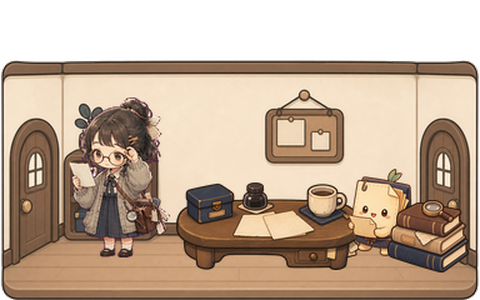

# Pet Studio

[](CHANGELOG.md)
[](LICENSE)

**Every Codex project gets its own tiny desktop room.**



Pet Studio is a local-first agent dashboard disguised as a tiny pet room. It turns Codex workspaces into layered desktop rooms with pets, props, helper pets, and live speech bubbles.

Instead of watching logs, watch your project room react as Codex starts working, uses tools, gets blocked, enters review, or finishes.

## Quick Start

```powershell
git clone https://github.com/makesomethingshit/codex-pet-studio-skill.git
cd codex-pet-studio-skill
.\tools\pet_studio_python.cmd tools\pet_studio_preflight.py
.\tools\pet_studio_widget.cmd --project-id gakju-archive-demo --scale 1.25
```

Install the Codex skill:

```powershell
.\tools\pet_studio_python.cmd tools\install_pet_studio_skill.py
```

Optional live bubble bridge:

```powershell
.\tools\pet_studio_python.cmd tools\install_pet_studio_codex_integration.py --project-id gakju-archive-demo
```

After installing hooks, restart Codex or open `/hooks` to review and trust the new commands when Codex asks.

## What Works Today

- Windows desktop widget for checked-in sample project rooms
- Layered room rendering: background, props, main pet, optional helper pets, speech bubbles
- Local project registry, saved layout, saved scale, and state file bridge
- Manual project states: `running`, `waiting`, `review`, `blocked`, `failed`, `done`
- Optional Codex hooks for prompt/tool/compact/stop bubble updates
- Script-driven room creation, validation, and preview sheets

## Still Experimental

- New room quality depends on the provided or generated art; visual QA is required.
- First-room creation is script-driven, not a GUI editor.
- Codex integration is a local file/hook bridge, not an official Codex dashboard API.
- Windows is the primary tested host.
- Internal storage still uses some `project-room-*` v1 compatibility names.

Not yet: multi-room gallery, one-click installer, cloud sync, team dashboard, macOS/Linux widget host, full simulation/game behavior.

## Model

One room maps to one Codex project or repo.

Each room can have its own mood, props, main pet, helper pets, speech bubble style, saved layout, and current state. The room is not only decoration; it is a compact visual project dashboard.

## Create A Room

```powershell
.\tools\pet_studio_python.cmd tools\pet_studio_create_room.py `
  --project-id my-room `
  --pet-package "$env:USERPROFILE\.codex\pets\my-pet" `
  --room-image runs\my-assets\room.png `
  --prop desk=runs\my-assets\desk.png `
  --prop-placement desk=behind-pet `
  --theme "quiet archive nook"
```

Full workflow: [docs/CREATE_ROOM.md](docs/CREATE_ROOM.md)

## Roadmap

The long-term vision is a small local dashboard where every Codex workspace has a recognizable room, state, mood, and companion behavior.

Next steps:

- smoother first-room creation
- clearer setup checks for hooks, Pillow, registries, and missing assets
- more room themes, prop packs, and state animations
- richer helper pet behavior and Codex event mapping
- multi-project room switcher
- macOS/Linux widget host
- lightweight room editor

Detailed roadmap: [docs/PET_STUDIO_ROADMAP.md](docs/PET_STUDIO_ROADMAP.md)

## Docs

- [Install](docs/INSTALL.md)
- [Create a room](docs/CREATE_ROOM.md)
- [Codex integration](docs/CODEX_INTEGRATION.md)
- [Development checks](docs/DEVELOPMENT.md)
- [Demo script](docs/DEMO_SCRIPT.md)
- [GitHub metadata](docs/GITHUB_METADATA.md)
- [Social preview](docs/SOCIAL_PREVIEW.md)
- [Contributing ideas](docs/CONTRIBUTING_IDEAS.md)

## License

MIT. See [LICENSE](LICENSE).
